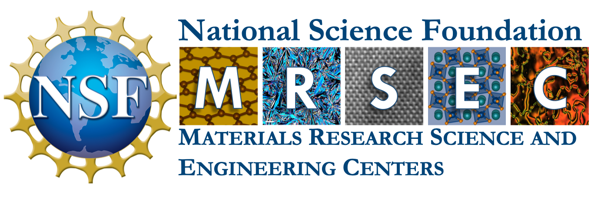

<h1 align="center">
  <picture>
    <source media="(prefers-color-scheme: dark)" srcset="resources/pytheos_light.svg">
    
  </picture>
</h1>

Python toolkit for high-entropy oxides (pytheos) is an open-source package built for exploring chemically disordered crystalline materials using computational methods. 

Density functional theory is our primary computational engine as it provides accurate predictions at the electronic and atomic scale. The r<sup>2</sup>SCAN meta-GGA functional is used by default for its improved accuracy over the more commonly used PBE GGA for oxide materials (see [Kothakonda et al.](https://pubs.acs.org/doi/full/10.1021/acsmaterialsau.2c00059) and [Almishal & Sivak et al.](https://www.sciencedirect.com/science/article/pii/S1359645424006396)). Additionally, we have started to implement machine-learning interatomic potentials, which we recently demonstrated have become accurate enough to rapidly screen for novel high-entropy oxides (see [Sivak et al.](https://arxiv.org/abs/2408.06322) and [Almishal et al.](https://arxiv.org/abs/2503.07865)).

Other open-source packages such as [pymatgen](https://github.com/materialsproject/pymatgen), [custodian](https://github.com/materialsproject/custodian), and [sumo](https://github.com/SMTG-Bham/sumo) as well as the [Materials Project database](https://next-gen.materialsproject.org/) are heavily utilized to leverage existing computational machinery and databases.

## Installation
1. Create a new python virtual environment and activate it.
- Requires `conda` (recommend using [Miniconda](https://www.anaconda.com/docs/getting-started/miniconda/main) as it is fairly lightweight).
```
conda create --name pytheos python=3.12
conda activate pytheos
```

2. Clone the repository.
```
git clone https://github.com/jsivak7/pytheos
cd pytheos 
```

3. Install the package.
- `-e` is for installing in editable mode (optional, but recommended).
```
pip install -e .
```

## Examples
*Jupyter notebooks are (will be...) provided to demonstrate how to use the code in the `examples/` folder.*


## Development & Bugs
In case you run into any issues please contact Jacob via email (jts6114@psu.edu) as this package is under active development. Thank you for any suggestions and contributions!

## Funding

This package is supported by the Penn State MRSEC [[DMR-2011839](https://www.mrsec.psu.edu)].

<h1 align="center">
  <picture>
    
  </picture>
</h1>


